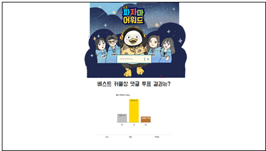

# 펭TV 파자마 어워드 베스트 커플 투표 집계

 

#### 개요

- 펭TV 파자마 어워드 베스트 커플 투표 댓글 집계

---

#### 설명

- SSAFY 교육생 대표로 '자이언트 펭TV' 출연 당시, 펭수 제작진이 의뢰했던 프로젝트입니다.

  

  당시 제작진은 투표 방식을 YouTube 댓글로 받았었습니다. 직접 사람이 집계한 방식과 프로그래밍을 이용해 집계한 방식의 차이를 방송에서 보여주기 위해, SSAFY 대표로 출연했던 저희에게 의뢰했었습니다.

  

  Python 크롤링을 이용하여 YouTube 댓글로 받은 투표를 가져온 다음 문자열 전처리와 집계과정을 통해 투표결과를 도출하였습니다. 투표결과는 Firebase 배포를 통해 Web 형식으로 보여주었습니다.

---

#### 특이사항

- 약 4200개의 댓글 취합.
- YouTube의 경우 전체 댓글을 크롤링하기 위해서는 밑으로 무한 스크롤하여 댓글을 계속 갱신해야함. 이를 위해 Selenium을 활용하여 댓글이 전부 다 나올 때 까지 무한 스크롤함.
- 댓글 투표라 투표형식의 제한이 없었음. 따라서 후보군 리스트를 따로 지정하여 문자열 비교 후 나온 후보가 리스트에 속해 있지 않으면 무효표로 처리함.
- 자체적인 무효표 처리로 인해 기존의 투표집계 결과와는 미미한 차이가 발생. 하지만 등수는 동일.

---

#### 기술 스택

- 언어
  - Java, Python, JavaScript, HTML, CSS
- 프레임워크 / 라이브러리
  - jQuery, Beautiful Soup, Selenium
- 기타
  - Firebase

---

| 인원 | 기여도 |
| ---- | ------ |
| 4명  | 25%    |

#### 주요역할

- 문자열 처리 및 투표수 집계
  - 1차적으로 Python 문자열 라이브러리를 통해 크롤링된 전체 댓글에서 나온 모든 단어를 취합하여 후보군 리스트 작성
  - 댓글과 후보군 리스트를 비교하여 투표 집계
  - 집계 결과를 Json 파일로 저장하여 Web 담당 인원에게 전달

---

#### 결과

- 자이언트 펭TV Ep.86, 2분 4초에 결과물이 영상에 표시 됨.

---

#### 관련 링크

- 결과물 : https://giantpengsoo-c0568.firebaseapp.com/  
(중앙에 돋보기 클릭 후 숫자 0 입력, 현재는 결과물 상태가 온전치 않음)
- YouTube
  - http://asq.kr/VEwFkOf1BJHe (댓글 투표 게시물)
  - https://youtu.be/wAFL7OcHGiI (‘자이언트 펭TV’ Ep.86)

---

